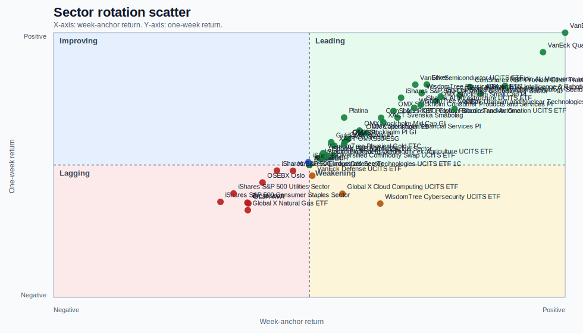
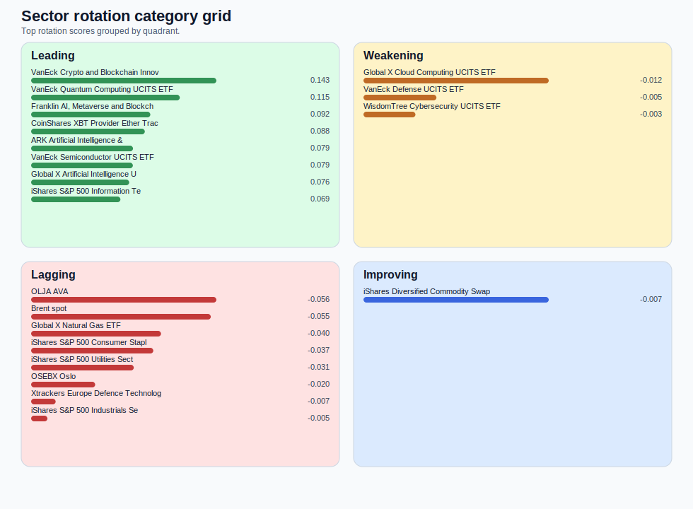
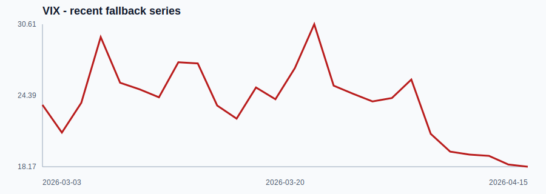

# Weekly Stock Market Science Report

Week: 2026-W16
Generated: 2026-04-17T08:53:08+00:00

## Executive summary
- Constructive risk appetite with concentrated leadership
- HY OAS latest reading is 2.85 on 2026-04-15. VIX latest reading is 18.17 on 2026-04-15.
- Maintain exposure to the strongest momentum names (Coor Service Management Holding AB, Telia Company, Besqab AB Pref B) and overweight leading themes such as VanEck Crypto and Blockchain Innovators UCITS ETF, VanEck Quantum Computing UCITS ETF, and Franklin AI, Metaverse and Blockchain UCITS ETF. Remain cautious on laggards like Xtrackers Europe Defence Technologies UCITS ETF 1C, Global X Cloud Computing UCITS ETF, and OSEBX Oslo ahead of this week's catalysts (AMD earnings, WFC results). (sources: market_snapshot, macro_snapshot, sector_rotation, signals_api, momentum_time_series, momentum_price, momentum_low_volatility, momentum_multi_factor, momentum_residual, web_weekend_context_1, web_weekend_context_2, web_weekend_context_3, web_what_to_watch_2, web_what_to_watch_3)

## Facts
- Leadership is concentrated in VanEck Crypto and Blockchain Innovators UCITS ETF, VanEck Quantum Computing UCITS ETF, Franklin AI, Metaverse and Blockchain UCITS ETF; while weakness remains in Xtrackers Europe Defence Technologies UCITS ETF 1C, Global X Cloud Computing UCITS ETF, OSEBX Oslo.
- Momentum leaders include Coor Service Management Holding AB, Telia Company, Besqab AB Pref B, Svedbergs Group AB ser. B, Swedbank AB ser A and the signal block also highlights Lagercrantz Group AB ser B, TF Bank AB, Synsam AB, Cloetta AB ser. B, Öresund, Investment AB.
- HY OAS moved from 3.08 on 2026-03-03 to 2.85 on 2026-04-15.
- Favor areas showing strong relative weekly leadership and positive short-term trend, and stay cautious with themes or instruments showing negative week-anchor returns and weak 1-2 week follow-through.

## Interpretation
- Momentum signals show strong leaders, but there are also conflicts across different momentum definitions that should temper conviction.
- The signal block leans bullish and supports risk-on positioning where momentum also holds together.
- Initial claims fallback data is missing; ISM PMI fallback data is missing; VIX latest reading is 18.17.

## Positioning for the week
- Maintain exposure to the strongest momentum names (Coor Service Management Holding AB, Telia Company, Besqab AB Pref B) and overweight leading themes such as VanEck Crypto and Blockchain Innovators UCITS ETF, VanEck Quantum Computing UCITS ETF, and Franklin AI, Metaverse and Blockchain UCITS ETF. Remain cautious on laggards like Xtrackers Europe Defence Technologies UCITS ETF 1C, Global X Cloud Computing UCITS ETF, and OSEBX Oslo ahead of this week's catalysts (AMD earnings, WFC results).
- Favor areas showing strong relative weekly leadership and positive short-term trend, and stay cautious with themes or instruments showing negative week-anchor returns and weak 1-2 week follow-through.

## How to read the momentum strategies
- `time_series`: Time-series momentum looks for stocks already trending higher over a longer window and assumes trend persistence can continue.
- `price`: Price momentum ranks stocks on medium-term relative performance and looks for sustained winners versus the rest of the universe.
- `low_volatility`: Low-volatility momentum favors names with strong trend behavior but less violent price movement, which can indicate steadier leadership.
- `multi_factor`: Multi-factor momentum blends momentum with volatility-aware ranking so the result is not driven by a single return measure alone.
- `residual`: Residual momentum tries to isolate stock-specific strength after removing broad market or beta effects.

## Sector / theme rotation
- Leading sectors: VanEck Crypto and Blockchain Innovators UCITS ETF, VanEck Quantum Computing UCITS ETF, Franklin AI, Metaverse and Blockchain UCITS ETF, CoinShares XBT Provider Ether Tracker One, ARK Artificial Intelligence & Robotics UCITS ETF, VanEck Semiconductor UCITS ETF, Global X Artificial Intelligence UCITS ETF, iShares S&P 500 Information Technology Sector
- Lagging sectors: Xtrackers Europe Defence Technologies UCITS ETF 1C, Global X Cloud Computing UCITS ETF, OSEBX Oslo, iShares S&P 500 Utilities Sector, iShares S&P 500 Consumer Staples Sector, Global X Natural Gas ETF, Brent spot, OLJA AVA (sources: sector_rotation)

### Quadrant scatter

### Category grid

### Sector rotation table
| Name | Quadrant | Week-anchor | 1W | 2W | Rotation score |
| --- | --- | --- | --- | --- | --- |
| VanEck Crypto and Blockchain Innovators UCITS ETF | leading | 11.79% | 12.67% | 23.08% | 0.1431 |
| VanEck Quantum Computing UCITS ETF | leading | 10.78% | 10.80% | 14.31% | 0.1149 |
| Franklin AI, Metaverse and Blockchain UCITS ETF | leading | 9.02% | 7.57% | 12.14% | 0.0921 |
| CoinShares XBT Provider Ether Tracker One | leading | 7.42% | 7.47% | 14.17% | 0.0878 |
| ARK Artificial Intelligence & Robotics UCITS ETF | leading | 7.89% | 6.84% | 9.36% | 0.0787 |
| VanEck Semiconductor UCITS ETF | leading | 4.89% | 7.69% | 15.56% | 0.0786 |
| Global X Artificial Intelligence UCITS ETF | leading | 6.93% | 6.68% | 10.55% | 0.0758 |
| iShares S&P 500 Information Technology Sector | leading | 6.06% | 6.55% | 9.53% | 0.0690 |
| Silver | leading | 5.42% | 7.71% | 8.73% | 0.0677 |
| WisdomTree Physical Silver ETC | leading | 5.18% | 6.87% | 8.85% | 0.0642 |
| iShares AI Infrastructure UCITS ETF | leading | 5.14% | 5.75% | 10.61% | 0.0641 |
| VanEck Uranium and Nuclear Technologies UCITS ETF | leading | 6.69% | 5.37% | 6.69% | 0.0630 |
| OMX Stockholm Small Cap PI | leading | 5.84% | 6.11% | 7.46% | 0.0625 |
| iShares S&P 500 Consumer Discretionary Sector | leading | 4.23% | 6.44% | 7.62% | 0.0557 |
| WisdomTree Copper | leading | 4.83% | 5.48% | 7.04% | 0.0547 |
| OMX Stockholm Consumer Products and Services PI | leading | 3.88% | 5.17% | 8.66% | 0.0522 |
| L&G ROBO Global Robotics and Automation UCITS ETF | leading | 4.07% | 4.54% | 9.06% | 0.0521 |
| CoinShares XBT Provider Bitcoin Tracker One | leading | 3.31% | 4.52% | 10.51% | 0.0511 |
| XACT Svenska Småbolag | leading | 3.41% | 4.09% | 7.42% | 0.0442 |
| OMX Stockholm Financial Services PI | leading | 2.65% | 3.04% | 6.93% | 0.0362 |

## Momentum leaders and laggards
- Leaders: Coor Service Management Holding AB, Telia Company, Besqab AB Pref B, Svedbergs Group AB ser. B, Swedbank AB ser A, Scandi Standard AB, Investor AB ser. B, Inission AB ser. B, Investor AB ser. A, Synsam AB
- Laggards: Truecaller AB ser. B, Hemnet Group AB, IRLAB Therapeutics AB ser. A, Alligator Bioscience AB, Profoto Holding AB, AB Fastator, Image Systems AB, Precise Biometrics AB, Transtema Group AB, KDventures B (sources: momentum_time_series, momentum_price, momentum_low_volatility, momentum_multi_factor, momentum_residual)

## Signals in focus
This section highlights which active technical signals confirm the current momentum picture and which names have repeated bullish or bearish setups.

- Synsam AB: signals support the momentum leadership (1 bullish, 0 bearish)
- Coor Service Management Holding AB: signals support the momentum leadership (2 bullish, 0 bearish)
- Telia Company: signals support the momentum leadership (1 bullish, 0 bearish)
- Inission AB ser. B: signals support the momentum leadership (1 bullish, 0 bearish)
- Scandi Standard AB: signals support the momentum leadership (2 bullish, 0 bearish)
- Cloetta AB ser. B: multiple bullish signals are active (2)
- Öresund, Investment AB: multiple bullish signals are active (4)
- Micro Systemation AB B: multiple bullish signals are active (3)
- Tele2 AB ser. B: multiple bullish signals are active (3)
- Hoist Finance AB: multiple bullish signals are active (2) (sources: signals_api)

### Active signal table
| Name | Signal | Direction | Confidence | Notes |
| --- | --- | --- | --- | --- |
| Synsam AB | DONCHIAN_MEAN_REVERSION | bullish | 0.34 | Close below 20d Donchian low — mean reversion entry |
| Viaplay Group AB ser. A | DONCHIAN_MEAN_REVERSION | bullish | 0.19 | Close below 20d Donchian low — mean reversion entry |
| Coor Service Management Holding AB | DONCHIAN_MEAN_REVERSION | bullish | 0.08 | Close below 20d Donchian low — mean reversion entry |
| mySafety Group AB ser. B | DONCHIAN_MEAN_REVERSION | bullish | 0.04 | Close below 20d Donchian low — mean reversion entry |
| ABB Ltd | FIFTY_TWO_WEEK_HIGH | bullish | n/a | n/a |
| ABB Ltd | HUNDRED_DAY_HIGH | bullish | n/a | n/a |
| AQ Group AB | FIFTY_TWO_WEEK_HIGH | bullish | n/a | n/a |
| AQ Group AB | HUNDRED_DAY_HIGH | bullish | n/a | n/a |
| Acrinova AB ser. A | HUNDRED_DAY_HIGH | bullish | n/a | n/a |
| Acrinova AB ser. B | FIFTY_TWO_WEEK_HIGH | bullish | n/a | n/a |
| Acrinova AB ser. B | HUNDRED_DAY_HIGH | bullish | n/a | n/a |
| Alfa Laval AB | FIFTY_TWO_WEEK_HIGH | bullish | n/a | n/a |
| Alfa Laval AB | HUNDRED_DAY_HIGH | bullish | n/a | n/a |
| Annehem Fastigheter AB ser. B | HUNDRED_DAY_HIGH | bullish | n/a | n/a |
| AstraZeneca PLC | MEAN_REVERSION | bullish | n/a | n/a |

## Momentum screener detail
This section shows the exact ranked names behind each screener so the report carries the actual evidence, not just a compressed summary.

### Time-series momentum screener
Time-series momentum looks for stocks already trending higher over a longer window and assumes trend persistence can continue.

### Top leaders
| Rank | Name | Score | Price |
| --- | --- | --- | --- |
| 1 | Cloetta AB ser. B | 2.3899 | 52.40 |
| 2 | Scandi Standard AB | 2.1880 | 158.60 |
| 3 | Hoist Finance AB | 1.8386 | 169.00 |
| 4 | Attendo AB | 1.7284 | 107.60 |
| 5 | Berner Industrier AB ser. B | 1.7281 | 95.50 |
| 6 | Coor Service Management Holding AB | 1.7189 | 57.80 |
| 7 | Lundin Mining Corporation | 1.6257 | 277.40 |
| 8 | Sandvik AB | 1.6106 | 396.60 |
| 9 | mySafety Group AB ser. B | 1.6016 | 17.90 |
| 10 | Axfood AB | 1.5532 | 321.00 |
| 11 | Tele2 AB ser. B | 1.5530 | 189.45 |
| 12 | Tele2 AB ser. A | 1.5411 | 192.00 |
| 13 | Actic Group AB | 1.5010 | 35.05 |
| 14 | Maha Capital AB | 1.4907 | 12.84 |
| 15 | Lundin Gold Inc. | 1.4436 | 756.00 |
| 16 | Telia Company | 1.4414 | 46.54 |
| 17 | HANZA AB | 1.4239 | 144.40 |
| 18 | Studsvik AB | 1.3828 | 327.00 |
| 19 | Acast | 1.3778 | 28.65 |
| 20 | Saniona AB | 1.3322 | 15.60 |

### Bottom laggards
| Rank | Name | Score | Price |
| --- | --- | --- | --- |
| 1 | IRLAB Therapeutics AB ser. A | -2.8659 | 1.55 |
| 2 | Profoto Holding AB | -2.4552 | 8.04 |
| 3 | Arctic Paper S.A. | -2.4407 | 20.39 |
| 4 | Hemnet Group AB | -2.3287 | 112.50 |
| 5 | Truecaller AB ser. B | -2.2869 | 10.96 |
| 6 | Alligator Bioscience AB | -2.2241 | 0.27 |
| 7 | Gentoo Media Inc. | -2.0555 | 6.55 |
| 8 | MEKO AB | -1.8249 | 70.40 |
| 9 | Pricer AB ser. B | -1.8246 | 3.06 |
| 10 | Yubico AB | -1.8040 | 39.34 |
| 11 | Isofol Medical AB | -1.7756 | 0.74 |
| 12 | Vitec Software Group AB ser. B | -1.7493 | 251.00 |
| 13 | Rottneros AB | -1.7394 | 2.49 |
| 14 | KABE Group AB ser. B | -1.7170 | 183.50 |
| 15 | Precise Biometrics AB | -1.6829 | 1.72 |
| 16 | Image Systems AB | -1.6311 | 0.95 |
| 17 | Boule Diagnostics AB | -1.5839 | 3.96 |
| 18 | AB Fastator | -1.5749 | 0.34 |
| 19 | Xbrane Biopharma AB | -1.5657 | 8.50 |
| 20 | G5 Entertainment AB | -1.5511 | 58.60 |

### Price momentum screener
Price momentum ranks stocks on medium-term relative performance and looks for sustained winners versus the rest of the universe.

### Top leaders
| Rank | Name | Score | Price |
| --- | --- | --- | --- |
| 1 | Sivers Semiconductors AB | 204.6100 | 21.70 |
| 2 | Anoto Group AB | 70.8300 | 0.07 |
| 3 | FM Mattsson AB ser. B | 66.0400 | 98.00 |
| 4 | Hexatronic Group AB | 65.6800 | 35.85 |
| 5 | Nokia | 65.4300 | 91.90 |
| 6 | International Petroleum Corporation | 64.7100 | 239.80 |
| 7 | Lundin Mining Corporation | 62.8100 | 277.40 |
| 8 | Cantargia AB | 59.8800 | 4.08 |
| 9 | Medivir AB | 59.7300 | 2.25 |
| 10 | Midsona AB ser. B | 58.0600 | 13.25 |
| 11 | Maha Capital AB | 57.8700 | 12.84 |
| 12 | Scandi Standard AB | 56.5700 | 158.60 |
| 13 | Cloetta AB ser. B | 56.4000 | 52.40 |
| 14 | Episurf Medical AB B | 54.8600 | 0.06 |
| 15 | Rusta AB | 53.7500 | 101.80 |
| 16 | Orrön Energy AB | 50.0200 | 7.35 |
| 17 | Hoist Finance AB | 48.7400 | 169.00 |
| 18 | Munters Group AB | 48.1700 | 190.80 |
| 19 | Acast | 47.3400 | 28.65 |
| 20 | Eniro Group AB | 47.3100 | 0.77 |

### Bottom laggards
| Rank | Name | Score | Price |
| --- | --- | --- | --- |
| 1 | Alligator Bioscience AB | -95.9600 | 0.27 |
| 2 | Wästbygg Gruppen AB ser. B | -84.1900 | 1.27 |
| 3 | Xbrane Biopharma AB | -80.5100 | 8.50 |
| 4 | Yubico AB | -74.2900 | 39.34 |
| 5 | Truecaller AB ser. B | -73.7700 | 10.96 |
| 6 | Oncopeptides AB | -73.6800 | 1.40 |
| 7 | KDventures B | -71.9800 | 0.26 |
| 8 | Nanologica AB | -66.1700 | 0.39 |
| 9 | Transtema Group AB | -65.6200 | 4.40 |
| 10 | Netel Holding AB | -60.3500 | 4.24 |
| 11 | Vivesto AB | -59.4300 | 0.08 |
| 12 | Nobia AB | -57.9500 | 1.81 |
| 13 | AB Fastator | -57.2600 | 0.34 |
| 14 | Active Biotech AB | -57.2400 | 0.07 |
| 15 | Immunovia AB | -56.5300 | 0.22 |
| 16 | Hemnet Group AB | -54.9800 | 112.50 |
| 17 | Profoto Holding AB | -54.4600 | 8.04 |
| 18 | Xspray Pharma AB | -50.5000 | 26.80 |
| 19 | Image Systems AB | -48.8600 | 0.95 |
| 20 | IRLAB Therapeutics AB ser. A | -48.5600 | 1.55 |

### Low-volatility screener
Low-volatility momentum favors names with strong trend behavior but less violent price movement, which can indicate steadier leadership.

### Top leaders
| Rank | Name | Score | Price |
| --- | --- | --- | --- |
| 1 | Volati AB Pref | 95.2381 | n/a |
| 2 | NP3 Fastigheter AB Pref | 58.4795 | n/a |
| 3 | Fastighetsbolaget Emilshus AB Pref | 49.2611 | n/a |
| 4 | Besqab AB Pref B | 48.7805 | n/a |
| 5 | Sagax AB D | 48.3092 | n/a |
| 6 | Fastpartner AB ser. D | 42.9185 | n/a |
| 7 | Traction AB ser. B | 39.2157 | n/a |
| 8 | Corem Property Group AB Pref | 36.9004 | n/a |
| 9 | Morrow Bank | 32.8947 | n/a |
| 10 | Sensys Gatso Group AB | 30.8642 | n/a |
| 11 | Prisma Properties AB | 28.8184 | n/a |
| 12 | Dedicare AB ser. B | 28.6533 | n/a |
| 13 | Softronic AB ser. B | 28.3286 | n/a |
| 14 | Corem Property Group AB ser. D | 28.2486 | n/a |
| 15 | Holmen AB ser. A | 27.1739 | n/a |
| 16 | KlaraBo Sverige AB ser. B | 26.5957 | n/a |
| 17 | Fabege AB | 26.3158 | n/a |
| 18 | CellaVision AB | 26.1780 | n/a |
| 19 | Holmen AB ser. B | 25.9067 | n/a |
| 20 | Viva Wine | 25.5102 | n/a |

### Bottom laggards
| Rank | Name | Score | Price |
| --- | --- | --- | --- |
| 1 | Active Biotech AB | 1.0868 | n/a |
| 2 | Oncopeptides AB | 1.0925 | n/a |
| 3 | Sivers Semiconductors AB | 1.3443 | n/a |
| 4 | Medivir AB | 1.3686 | n/a |
| 5 | Cantargia AB | 2.5189 | n/a |
| 6 | Anoto Group AB | 2.5445 | n/a |
| 7 | Alligator Bioscience AB | 2.7427 | n/a |
| 8 | Maha Capital AB | 2.9121 | n/a |
| 9 | Episurf Medical AB B | 3.3818 | n/a |
| 10 | Xspray Pharma AB | 3.4130 | n/a |
| 11 | Nanologica AB | 3.5958 | n/a |
| 12 | Nelly Group AB | 3.6179 | n/a |
| 13 | Tobii AB | 3.6324 | n/a |
| 14 | Actic Group AB | 3.6941 | n/a |
| 15 | Xbrane Biopharma AB | 3.8285 | n/a |
| 16 | Immunovia AB | 3.9448 | n/a |
| 17 | Stillfront Group AB | 4.2517 | n/a |
| 18 | Orexo AB | 4.3328 | n/a |
| 19 | Viaplay Group AB ser. A | 4.6147 | n/a |
| 20 | Gruvaktiebolaget Viscaria | 4.6232 | n/a |

### Multi-factor screener
Multi-factor momentum blends momentum with volatility-aware ranking so the result is not driven by a single return measure alone.

### Top leaders
| Rank | Name | Score | Price |
| --- | --- | --- | --- |
| 1 | Investor AB ser. B | 0.9045 | 376.80 |
| 2 | Investor AB ser. A | 0.9007 | 374.00 |
| 3 | Telia Company | 0.8921 | 46.54 |
| 4 | Coor Service Management Holding AB | 0.8821 | 57.80 |
| 5 | Besqab AB Pref B | 0.8710 | 99.00 |
| 6 | Alfa Laval AB | 0.8685 | 559.20 |
| 7 | Svedbergs Group AB ser. B | 0.8685 | 63.90 |
| 8 | Svolder AB ser. A | 0.8648 | 85.00 |
| 9 | Nordnet AB | 0.8610 | 346.40 |
| 10 | Securitas AB ser. B | 0.8573 | 170.50 |
| 11 | Swedbank AB ser A | 0.8511 | 335.40 |
| 12 | Inission AB ser. B | 0.8462 | 62.40 |
| 13 | BioGaia AB ser. B | 0.8449 | 120.60 |
| 14 | Nordea Bank Abp | 0.8387 | 173.50 |
| 15 | Synsam AB | 0.8325 | 62.70 |
| 16 | Industrivärden, AB ser. C | 0.8288 | 493.50 |
| 17 | Industrivärden, AB ser. A | 0.8275 | 497.20 |
| 18 | Prisma Properties AB | 0.8263 | 23.80 |
| 19 | Axfood AB | 0.8226 | 321.00 |
| 20 | Scandi Standard AB | 0.8226 | 158.60 |

### Bottom laggards
| Rank | Name | Score | Price |
| --- | --- | --- | --- |
| 1 | Oncopeptides AB | 0.0074 | 1.40 |
| 2 | Alligator Bioscience AB | 0.0074 | 0.27 |
| 3 | Active Biotech AB | 0.0161 | 0.07 |
| 4 | Xbrane Biopharma AB | 0.0199 | 8.50 |
| 5 | Nanologica AB | 0.0211 | 0.39 |
| 6 | Wästbygg Gruppen AB ser. B | 0.0310 | 1.27 |
| 7 | Xspray Pharma AB | 0.0323 | 26.80 |
| 8 | Immunovia AB | 0.0360 | 0.22 |
| 9 | Tobii AB | 0.0422 | 1.92 |
| 10 | Stillfront Group AB | 0.0571 | 4.72 |
| 11 | Netel Holding AB | 0.0620 | 4.24 |
| 12 | Fasadgruppen Group AB | 0.0720 | 21.70 |
| 13 | Orexo AB | 0.0744 | 20.50 |
| 14 | KDventures B | 0.0769 | 0.26 |
| 15 | Nelly Group AB | 0.0819 | 69.35 |
| 16 | PowerCell Sweden AB | 0.0844 | 24.10 |
| 17 | Nobia AB | 0.0868 | 1.81 |
| 18 | Net Insight AB ser. B | 0.0868 | 2.55 |
| 19 | Mendus AB | 0.0931 | 4.92 |
| 20 | Dometic Group AB | 0.0955 | 30.20 |

### Residual momentum screener
Residual momentum tries to isolate stock-specific strength after removing broad market or beta effects.

### Top leaders
| Rank | Name | Score | Price |
| --- | --- | --- | --- |
| 1 | Lundin Mining Corporation | 0.8893 | 277.40 |
| 2 | Coor Service Management Holding AB | 0.8363 | 57.80 |
| 3 | Sandvik AB | 0.8353 | 396.60 |
| 4 | Scandi Standard AB | 0.7844 | 158.60 |
| 5 | Hoist Finance AB | 0.7114 | 169.00 |
| 6 | Cloetta AB ser. B | 0.6654 | 52.40 |
| 7 | Attendo AB | 0.6183 | 107.60 |
| 8 | Swedbank AB ser A | 0.6032 | 335.40 |
| 9 | ABB Ltd | 0.5802 | 851.80 |
| 10 | HANZA AB | 0.5759 | 144.40 |
| 11 | Svedbergs Group AB ser. B | 0.5578 | 63.90 |
| 12 | Nordea Bank Abp | 0.5566 | 173.50 |
| 13 | Lundin Gold Inc. | 0.5487 | 756.00 |
| 14 | Synsam AB | 0.5443 | 62.70 |
| 15 | FM Mattsson AB ser. B | 0.5402 | 98.00 |
| 16 | Studsvik AB | 0.5262 | 327.00 |
| 17 | Telia Company | 0.4975 | 46.54 |
| 18 | Tele2 AB ser. B | 0.4851 | 189.45 |
| 19 | Besqab AB Pref B | 0.4824 | 99.00 |
| 20 | Tele2 AB ser. A | 0.4797 | 192.00 |

### Bottom laggards
| Rank | Name | Score | Price |
| --- | --- | --- | --- |
| 1 | Hemnet Group AB | -1.2839 | 112.50 |
| 2 | Latour, Investmentab. ser. B | -1.1309 | 228.20 |
| 3 | Truecaller AB ser. B | -1.0084 | 10.96 |
| 4 | Image Systems AB | -0.9617 | 0.95 |
| 5 | IRLAB Therapeutics AB ser. A | -0.9563 | 1.55 |
| 6 | Precise Biometrics AB | -0.9522 | 1.72 |
| 7 | AB Fastator | -0.8707 | 0.34 |
| 8 | SWECO AB ser. B | -0.8020 | 147.00 |
| 9 | SWECO AB ser. A | -0.7951 | 146.50 |
| 10 | Profoto Holding AB | -0.7923 | 8.04 |
| 11 | AFRY AB | -0.7671 | 128.70 |
| 12 | BE Group AB | -0.7441 | 26.00 |
| 13 | Vitec Software Group AB ser. B | -0.7329 | 251.00 |
| 14 | KABE Group AB ser. B | -0.7286 | 183.50 |
| 15 | Arctic Paper S.A. | -0.7278 | 20.39 |
| 16 | Garo AB | -0.7193 | 11.52 |
| 17 | Transtema Group AB | -0.7108 | 4.40 |
| 18 | Stockwik Förvaltning AB | -0.6923 | 17.60 |
| 19 | MEKO AB | -0.6754 | 70.40 |
| 20 | KDventures B | -0.6679 | 0.26 |

## Macro context notes
- `HY_OAS`: HY_OAS means High Yield Option-Adjusted Spread. It tracks the extra yield demanded for lower-quality corporate debt, and wider spreads usually point to rising stress or tighter financial conditions.
- `VIX`: VIX is the CBOE Volatility Index. It is an options-implied volatility measure for US equities, and sharp increases usually signal more fear and demand for downside protection.

## VIX chart

## Weekend context / what happened
- Here are the 3 big things we're watching in the stock market this week - CNBC: Week ahead Monday, April 13 Existing Home Sales at 10 a.m. ET Before the bell: Goldman Sachs (GS) , Fastenal (FAST) Tuesday, April 14 Producer Price Index at 8:30 a.m. [web_weekend_context_1]
- S&P 7,000: Why stocks surged to a new record - Axios: Zoom in: Starting last week, hedge funds were net buyers of U.S. stocks for the first time in eight weeks, driven by both closing out short bets (where investors bet that stocks will fall) and adding new long positions, per data from Gol... [web_weekend_context_2]
- Stock Market Today: Major Indexes Mixed in Early Trading; S&P 500 Nears All-Time High; Oil Prices Tick Lower as Investors Assess Iran Developments - Investopedia: Stock Market Today: Major Indexes Mixed in Early Trading; S&P 500 Nears All-Time High; Oil Prices Tick Lower as Investors Assess Iran Developments. Major stock indexes were mixed and little changed in early trading Wednesday, with the S&... [web_weekend_context_3]

## What to watch this week
- AMD Gains 6% Ahead of May Earnings: Is the AI Chip Challenger Finally Ready to Rival NVIDIA? - 24/7 Wall St.: Advanced Micro Devices (AMD) stock surged today on France collaboration and $60M Wayve investment announcements. Advanced Micro Devices (NASDAQ:AMD | AMD Price Prediction) stock is up 6% today, rising from $258.12 to $274 and change as a... [web_what_to_watch_2]
- WFC Earnings: Wells Fargo Stock Slips on Mixed Q1 Results - TipRanks: WFC Earnings: Wells Fargo Stock Slips on Mixed Q1 Results. Wells Fargo stock was down on Tuesday alongside its latest earnings report. [web_what_to_watch_3]

## Risks / uncertainty
- Leadership remains concentrated rather than broad-based
- Primary market and macro snapshot endpoints are unavailable
- Data gaps reduce confidence in the weekly base case
- Market snapshot unavailable: HTTPStatusError("Client error '404 ' for url 'http://192.168.1.71:8080/api/v1/market-snapshot'\nFor more information check: https://developer.mozilla.org/en-US/docs/Web/HTTP/Status/404")
- Regime fallback unavailable: HTTPStatusError("Server error '500 ' for url 'http://192.168.1.71:8080/api/regime/composite/latest'\nFor more information check: https://developer.mozilla.org/en-US/docs/Web/HTTP/Status/500")
- Macro snapshot unavailable: HTTPStatusError("Client error '404 ' for url 'http://192.168.1.71:8080/api/v1/macro-snapshot'\nFor more information check: https://developer.mozilla.org/en-US/docs/Web/HTTP/Status/404")

## What would change my mind
- Leadership broadens beyond the current narrow set of leaders
- Signal contradictions dominate the bullish signal mix
- Macro fallback data worsens via wider credit spreads or higher volatility

## Sources
- [market_snapshot] Market snapshot API (market_api) - Market snapshot API failed: HTTPStatusError("Client error '404 ' for url 'http://192.168.1.71:8080/api/v1/market-snapshot'\nFor more information check: https://developer.mozilla.org/en-US/docs/Web/HTTP/Status/404") - http://192.168.1.71:8080/api/v1/market-snapshot
- [macro_snapshot] Macro snapshot API (macro_api) - Primary macro snapshot API failed, fallback macro sources were attempted: HTTPStatusError("Client error '404 ' for url 'http://192.168.1.71:8080/api/v1/macro-snapshot'\nFor more information check: https://developer.mo... - http://192.168.1.71:8080/api/v1/macro-snapshot
- [regime_composite_latest] Latest composite regime (macro_api) - Latest regime composite request failed: HTTPStatusError("Server error '500 ' for url 'http://192.168.1.71:8080/api/regime/composite/latest'\nFor more information check: https://developer.mozilla.org/en-US/docs/Web/HTT... - http://192.168.1.71:8080/api/regime/composite/latest
- [external_hy_oas] External series HY_OAS (macro_api) - External series HY_OAS returned 27 points. - http://192.168.1.71:8080/api/external-data?seriesName=HY_OAS
- [external_unemployment_claims] External series UNEMPLOYMENT_CLAIMS (macro_api) - External series UNEMPLOYMENT_CLAIMS returned 0 points. - http://192.168.1.71:8080/api/external-data?seriesName=UNEMPLOYMENT_CLAIMS
- [external_ism_pmi] External series ISM_PMI (macro_api) - External series ISM_PMI returned 0 points. - http://192.168.1.71:8080/api/external-data?seriesName=ISM_PMI
- [external_vix] External series VIX (macro_api) - External series VIX returned 26 points. - http://192.168.1.71:8080/api/external-data?seriesName=VIX
- [sector_rotation] Sector rotation API (sector_rotation_api) - Sector rotation API returned 52 instruments for weekly analysis. - http://192.168.1.71:8080/api/v1/sector-rotation/weekly
- [momentum_time_series] Time-series momentum screener (momentum_api) - Momentum screen 'time_series' succeeded. - http://192.168.1.71:8080/api/v1/screen/tsmom
- [momentum_price] Price momentum screener (momentum_api) - Momentum screen 'price' succeeded. - http://192.168.1.71:8080/api/v1/screen/price-momentum
- [momentum_low_volatility] Low-volatility screener (momentum_api) - Momentum screen 'low_volatility' succeeded. - http://192.168.1.71:8080/api/v1/screen/low-volatility
- [momentum_multi_factor] Multi-factor screener (momentum_api) - Momentum screen 'multi_factor' succeeded. - http://192.168.1.71:8080/api/v1/screen/multi-factor
- [momentum_residual] Residual momentum screener (momentum_api) - Momentum screen 'residual' succeeded. - http://192.168.1.71:8080/api/v1/screen/residual-momentum
- [signals_api] Signals API (signals_api) - Signals API returned 99 active stock signals. - http://192.168.1.71:8080/api/v1/signals
- [web_weekend_context_1] Here are the 3 big things we're watching in the stock market this week - CNBC (web) - Week ahead Monday, April 13 Existing Home Sales at 10 a.m. - https://www.cnbc.com/2026/04/12/here-are-the-3-big-things-were-watching-in-the-stock-market-this-week.html
- [web_weekend_context_2] S&P 7,000: Why stocks surged to a new record - Axios (web) - Zoom in: Starting last week, hedge funds were net buyers of U.S. - https://www.axios.com/2026/04/15/stocks-iran-consumer-trump
- [web_weekend_context_3] Stock Market Today: Major Indexes Mixed in Early Trading; S&P 500 Nears All-Time High; Oil Prices Tick Lower as Investors Assess Iran Developments - Investopedia (web) - Stock Market Today: Major Indexes Mixed in Early Trading; S&P 500 Nears All-Time High; Oil Prices Tick Lower as Investors Assess Iran Developments. - https://www.investopedia.com/stock-market-today-dow-jones-s-and-p-500-04152026-11950191
- [web_what_to_watch_2] AMD Gains 6% Ahead of May Earnings: Is the AI Chip Challenger Finally Ready to Rival NVIDIA? - 24/7 Wall St. (web) - Advanced Micro Devices (AMD) stock surged today on France collaboration and $60M Wayve investment announcements. - https://247wallst.com/investing/2026/04/16/amd-gains-6-ahead-of-may-earnings-is-the-ai-chip-challenger-finally-ready-to-rival-nvidia/
- [web_what_to_watch_3] WFC Earnings: Wells Fargo Stock Slips on Mixed Q1 Results - TipRanks (web) - WFC Earnings: Wells Fargo Stock Slips on Mixed Q1 Results. - https://www.tipranks.com/news/wfc-earnings-wells-fargo-stock-slips-on-mixed-q1-results
